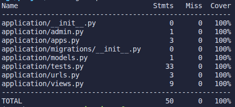

# BUT3-TutoDjango  

Maelyss FRONTON 31A, (présentation)  

## Installation des dépendances  

Il est recommandé de créer un environnement virtuel Python pour l'installation des dépendances afin d'éviter de casser les installations globales. La commande est : `virtualenv -p python3 venv`.  
Pour installer les dépendances, se placer à la racine du projet et lancer la commande `pip install -r requirements.txt`. On dispose maintenant des paquets nécessaires au projet et on peut lancer l'application.

## Lancement de l'application  

Pour lancer l'application, se positionner dans le dossier `./projet` du répertoire et exécuter la commande `python manage.py runserver` qui va lancer le serveur. On peut maintenant accéder aux pages grâce à l'url `http://127.0.0.1:8000/<page qu'on veut accéder>/`, par exemple `http://127.0.0.1:8000/application/`.  

### Routes disponibles  

Voici la liste des routes accessibles avec l'url `http://127.0.0.1:8000/<route>/` :  
- `application` ou `application/home` pour la page d'accueil  
- `application/<nom>` ou `application/home/<nom>`, pour la page d'accueil personnalisée  
- `application/contact` pour la page de contact  
- `application/about` pour en savoir plus sur l'auteur  

## Tests  

Le projet est accompagné de tests se situant dans le dossier `./projet/application/tests.py` ils peuvent être lancés en se positionnant dans le dossier `./projet` du répertoire et en exécutant la commande `coverage run --source="application" manage.py test`.  

On peut visualiser un rapport de coverage sous forme de tableau en exécutant la commande `coverage report`, dont voici la sortie :  
  

Le dernier rapport de coverage généré peut être visualisé sous forme de fichier HTML en ouvrant dans le navigateur le fichier `./projet/htmlcov/index.html`.  

## État d'avancement  

J'en suis au TDn°1, à la question "Petit challenge" sur la dernière page. J'ai créé les vues d'about, contact, home et je les ai routées, il me manque just à écrire les tests associés pour terminer le TD.